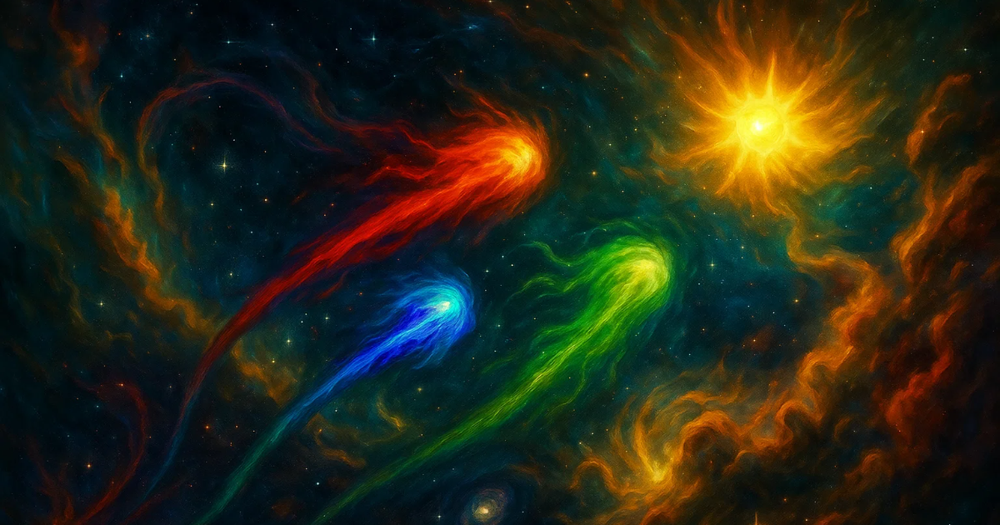

# Procedural Star Chasers

Canvas-driven space playground built with Solid.js. Three autonomous ships chase stars, react to asteroid waves, exchange radio chatter, and can briefly be handed over to the player for manual control.



## What the project is

This is an interactive simulation, not a level-based game. The appeal is in watching behavior emerge:

- ships compete for stars and accelerate as they score
- each ship has a persona (Faísca, Folhagem, Cobalto) and its own intent engine: drives (rest, rivalry, sociability, curiosity) that evolve with events and pick its next intent, shown live in the HUD
- ships form relationships — a rescue warms a pair into loose formation and friendly banter; collisions sour them into rivalry and taunts
- asteroid events force temporary cooperation; paralyzed ships can be rescued by allies at the cost of a star
- radio chatter reflects what is happening on screen
- cursor orbit, wormholes, and pilot mode let you interfere with the system

The world is 4x the viewport; when you stop interacting, an **auto-director** camera gently follows the action so it stays watchable.

## Continuity (local only)

A per-browser "diário de bordo" (press `H`) remembers your visits, watch time, stars witnessed per ship, and records — all in `localStorage`, no accounts, nothing leaves your machine. You can optionally sign it with a name the ships then use, and "adopt" (apadrinhar) a ship that celebrates your visits and greets you when you return.

## Current interaction model

### Desktop

- Drag with the cursor to pull ships into orbit, then release to launch them
- Right click to open the in-game context menu
- Click when cursor orbit is disabled to create a wormhole
- Press `P` to pilot a ship manually: arrow keys steer, `Space` fires, `R` reloads
- Press `M` to toggle cursor orbit / wormhole mode
- Press `S` to mute or unmute
- Press `F` to toggle fullscreen

### Camera

- `Tab` cycles which ship the camera follows; `1` / `2` / `3` follow a specific ship
- `0` or `Escape` releases the camera; arrow keys pan when no ship is followed
- After ~12s without input the camera hands over to the auto-director (shown in the navigator); any input takes it back
- The minimap (top right) shows ships, target star, and asteroids — click it to jump the camera or click a ship dot to follow it

### Mobile

- Use the floating action button to open controls
- Tap ships for a small burst effect
- Long press on the canvas to open the context menu

## Stack

- Solid.js
- TypeScript
- Canvas 2D
- Tailwind CSS 4
- Vite + Vitest

## Project structure

```text
src/
  game/
    core/      engine, fixed-timestep loop, update pipeline
    systems/   asteroids, collisions, projectiles, radio, wormholes...
    entities/  ships, personas, vectors, game objects
    render/    canvas renderers, view culling
    audio/     sound loading and playback
    services/  radio chatter, constellations, wake lock, settings
    input/     mouse/touch/keyboard state
    data/      radio chatter lines per ship
  ui/          Solid components (canvas host, HUD, dialogs)
```

The game logic is split across focused managers wired into an ordered system pipeline (`src/game/core/engine-updater.ts`), so adding a feature usually means adding one system.

## Run locally

```bash
npm install
npm run dev
```

The dev server runs on `http://localhost:3000`.

Other scripts: `npm test`, `npm run lint`, `npm run typecheck`.

## Build

```bash
npm run build
```

Production output is generated in `dist/`.

## What should improve next

Done recently: auto-director camera, per-ship intent engine, ship relationships, the local logbook with signature + patron, and ships acknowledging the visitor.

Still open:

- more "juice" on key moments: off-screen indicators, slow-motion + flash on star captures, an event feed in the HUD
- add a session arc: short races with a victory ceremony instead of an endless score
- publish screenshots or a short gameplay GIF in the README
